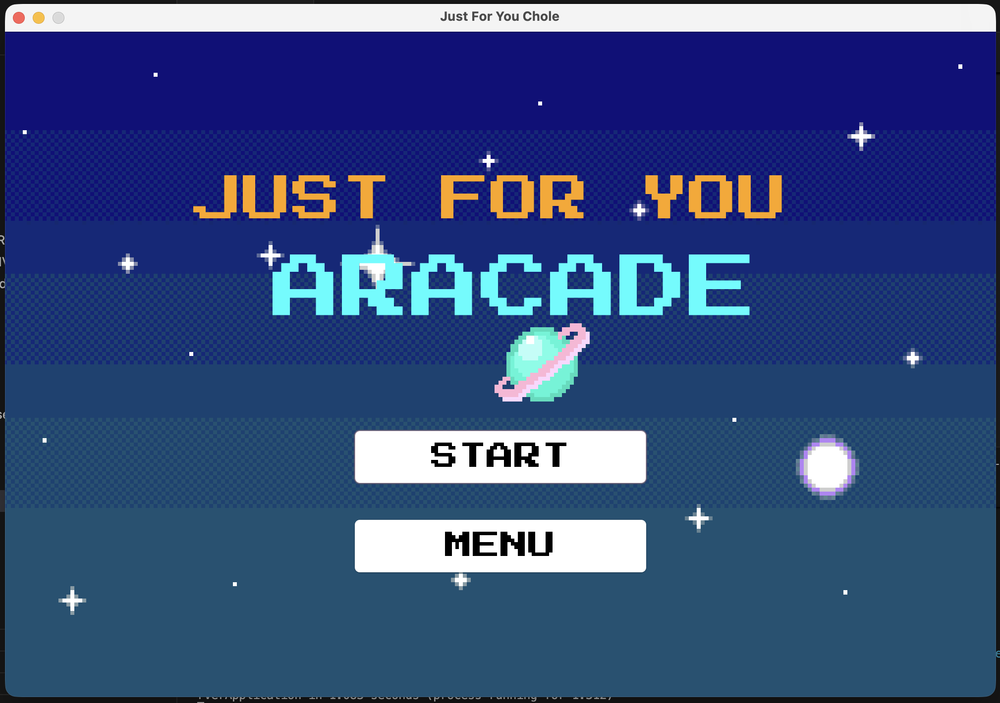
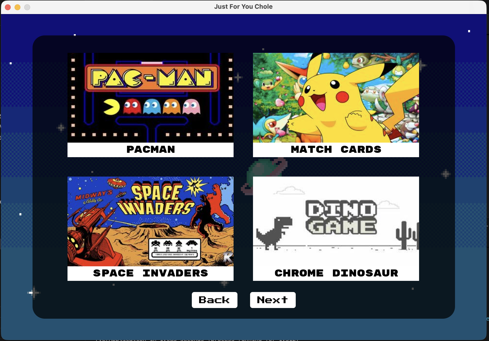
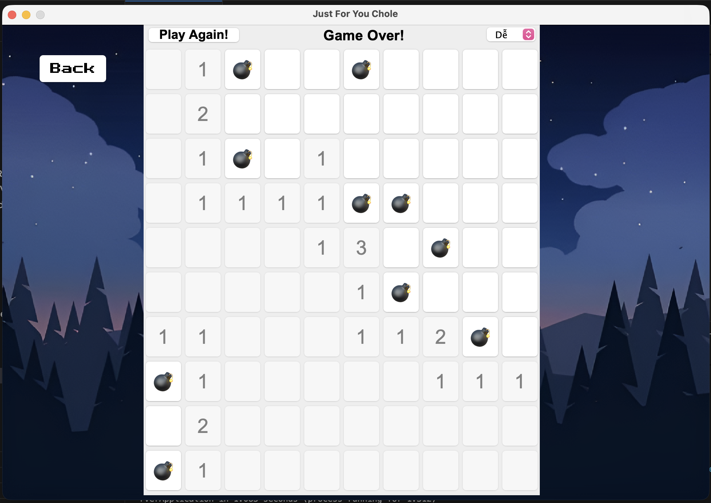
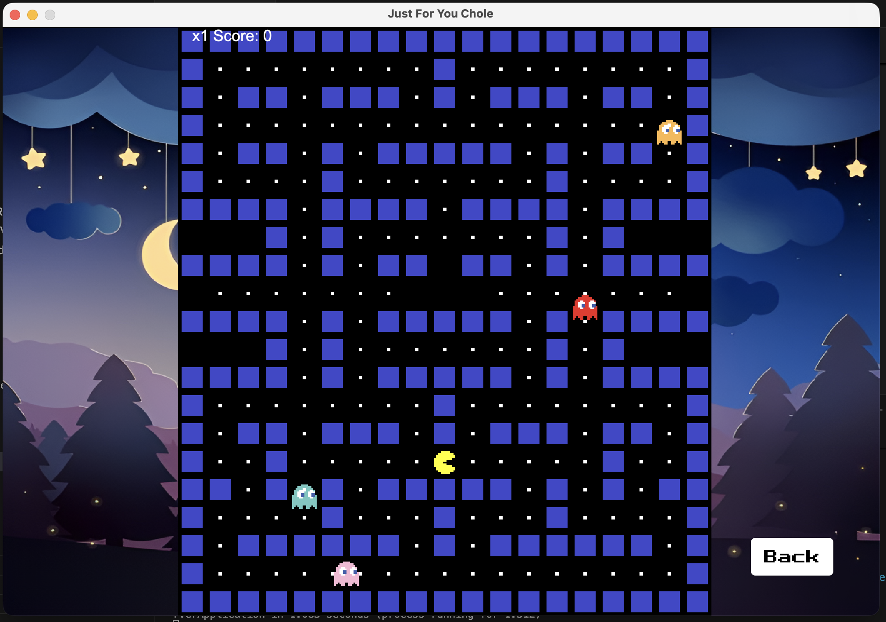

# J4U Arcade 🎮

[](https://github.com/heoconngoc/Anni/actions/workflows/ci.yml)
[](LICENSE)


**J4U Arcade** ("Just For You") started as a personal gift: eight classic
mini-games packed into a single **Java Swing** desktop app. It has since grown
into a full **client–server** system — scores sync to a **Spring Boot** REST
backend backed by **PostgreSQL**, while an offline-first **SQLite** layer keeps
every game playable anytime, anywhere.

---

## 🕹️ Games

| | | | |
|---|---|---|---|
| Snake | Pac-Man | Space Invaders | Chrome Dinosaur |
| Flappy Bird | Whac-A-Mole | Match Cards | Minesweeper |

All games share one shell: animated menus, per-game rule screens, sound
effects, and a global high-score hub.

| Welcome Screen | Game List |
|---|---|
|  |  |
| **Minesweeper** | **Pacman** |
|  |  |


## 🏛️ Architecture

Multi-module Maven build — one shared contract module consumed by both ends:

```
J4U-Arcade/
├── common   Shared data contracts: GameCatalog, ScoreEntry,
│            UserRepository, ScoreRepository interfaces
│
├── app      Swing desktop client
│     GUI & games ── ScoreService ── ScoreStore
│                                  ├── HttpScoreStore   → REST API
│                                  │                      (auto-fallback ↓)
│                                  └── SqliteScoreStore  → local SQLite
│
└── server   Spring Boot REST API
      ├── Flyway migrations · H2 in-memory (dev) · PostgreSQL (prod profile)
      └── JDBC repositories implementing the SAME interfaces as the client
```

The client talks HTTP-first and falls back to local SQLite per call when the
server is unreachable — **the game never breaks because of the network**, and
the GUI never knows which store is active.

### REST API

| Method | Path | Description |
|---|---|---|
| `POST` | `/api/scores` | Submit a run: `{username, gameId, score}` |
| `GET` | `/api/games/{id}/top?limit=3` | Leaderboard (best run per player) |
| `GET` | `/api/users/{user}/best/{gameId}` | Personal best |
| `GET` | `/api/games` | Game catalog |

## 🚀 Getting Started

**Prerequisites:** JDK 17+, Maven 3.8+ (Docker optional).

```bash
# Build everything and install modules into ~/.m2
mvn clean install

# Run the desktop app
java -jar app/target/anni-arcade.jar

# Run the backend (H2 in-memory, port 8080)
java -jar server/target/anni-server.jar

# …or the whole stack with PostgreSQL via Docker
docker compose up --build
```

Daily development shortcut: `mvn compile exec:java -pl app`
(requires `mvn clean install` once first).

To sync scores with the server, point the client at it — create a `.env` next
to the jar (see [`.env.example`](.env.example)):

```ini
API_URL=http://localhost:8080/api
```

Leave `API_URL` empty to stay fully offline.

### Configuration (`.env`)

| Key | Purpose |
|---|---|
| `APP_VALID_USERS` | Comma-separated usernames allowed to log in |
| `APP_PASSWORD` | Login password |
| `LETTER_GUEST`, `LETTER_SPECIAL_1..3` | Personal letter contents (`{name}` placeholder, `\n` = newline) |
| `DB_PATH` | Local SQLite file (default `anni.db`) |
| `API_URL` | Backend base URL; empty = offline mode |

## ✅ Testing

```bash
mvn clean verify               # full suite across all modules (CI gate)

# Real-GUI regression suite for the keyboard-focus contract (D13).
# Boots the actual app, navigates into each key-driven game, verifies focus
# ownership and synthetic input. Self-skips without a display:
ANNI_GUI_PROBE=1 mvn test
```

CI runs the same suite headless on every push via GitHub Actions.

## 📚 Documentation

- [`docs/ARCHITECTURE.md`](docs/ARCHITECTURE.md) — current architecture, navigation model, data flow
- [`docs/CODING_CONVENTIONS.md`](docs/CODING_CONVENTIONS.md) — code style and Swing patterns used in this codebase
- [`docs/DECISIONS.md`](docs/DECISIONS.md) — architecture decision records (D01–D15)

## License

Released under the [MIT License](LICENSE).
